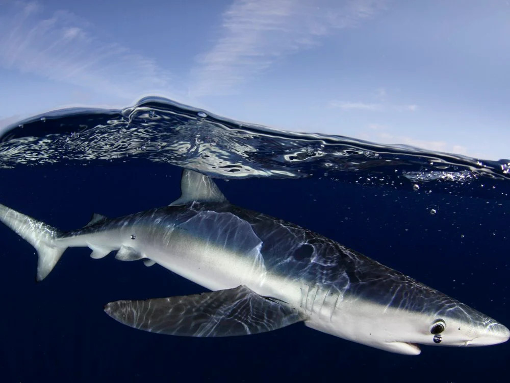

# Population Genetics and Genomics

 

## MedBlueSGen: a population genetic study on Mediterranean and North East Atlantic blue shark for stocks identification and conservation

<figure>
 
<figcaption> Blue shark. Photo: Nuno Sa/Nature Picture Library/Corbis.</figcaption>
</figure>

  
Characterize the population structure of the Mediterranean and neighboring Atlantic blue shark, *Prionace glauca*, populations, for stock delineation and conservation. (Click to expand)

  
 
  
Through genome-representative and ddRAD-derived SNP markers, we are investigating the population structure of the Mediterranean and North East Atlantic blue shark, in order to delineate the number of populations detecatable in the study areas. Genome-representative markers allows a way deeper search for population genetic signals capable to discriminate different populations, which may be under the effect of separate demographic processes. This is mandatory to better manage the stock and preserve their resilience under the direct and undirect anthropogenic pressures (overfishing, loss of habitat, climate change, etc.).
The project is funder by the Joint Research Center of the European Union, and the project website can be seen
<a href="https://sustainable-fisheries.ec.europa.eu/fisheries-genetics/projects-fisheries-genetics/medbluesgen_en">here</a>.
An interactive sampling map is available <a href="https://sustainable-fisheries.ec.europa.eu/fisheries-genetics/projects-fisheries-genetics/medbluesgen/dataset_en">here</a>.
Published articles within this project can be viewed <a href="https://leoneago.github.io/02-Publications.html">here</a>

 

## Deep-Sea rockfish adaptation and population structure
<figure>
 
</figure>

# environmental DNA

## The environmental DNA and Marine Protected Areas - National Biodiversity Future Center, NBFC

<figure>
 
</figure>
