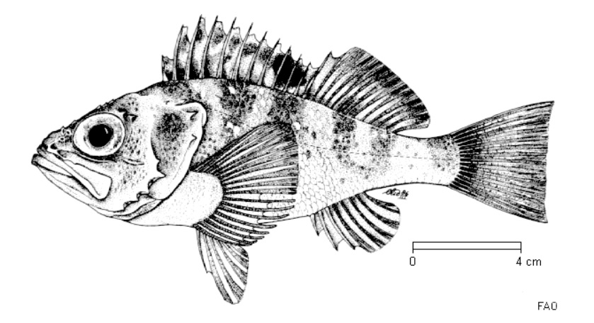

# Population Genetics and Genomics

 

## MedBlueSGen: a population genetic study on Mediterranean and North East Atlantic blue shark for stocks identification and conservation

<figure>
 
<figcaption> Photo By Diego Delso, CC BY-SA 4.0, https://commons.wikimedia.org/w/index.php?curid=108259682.</figcaption>
</figure>

  
Characterize the population structure of the Mediterranean and neighboring Atlantic blue shark, *Prionace glauca*, populations, for stock delineation and conservation. (Click to expand)

  
 
  
Through genome-representative and ddRAD-derived SNP markers, we are investigating the population structure of the Mediterranean and North East Atlantic blue shark, in order to delineate the number of populations detecatable in the study areas. Genome-representative markers allows a way deeper search for population genetic signals capable to discriminate different populations, which may be under the effect of separate demographic processes. This is mandatory to better manage the stocks and preserve their resilience under the direct and undirect anthropogenic pressures (overfishing, loss of habitat, climate change, etc.).
The MedBlueSGen project is funder by the Joint Research Center of the European Union, and the project website can be seen
<a href="https://sustainable-fisheries.ec.europa.eu/fisheries-genetics/projects-fisheries-genetics/medbluesgen_en">here</a>.
An interactive sampling map is available <a href="https://sustainable-fisheries.ec.europa.eu/fisheries-genetics/projects-fisheries-genetics/medbluesgen/dataset_en">here</a>.
Published articles within this project can be viewed <a href="https://leoneago.github.io/02-Publications.html">here</a>

 

## Deep-sea rockfish adaptation and population structure
<figure>
 
</figure>

  
Characterize the population structure and the genomic adaptations to the deep environments of the blackbelly rosefish, *Helicolenus dactylopterus*, along the North East Atlantic Ocean. (Click to expand)

  
 
  
Using genome-wide SNP markers, we are investigating the population structure of this common but still enigmatic deep-sea rockfish, together with its genomic adaptation to the extreme environments where this species live.
Analasyng genome-wide markers of blackbelly rosefish catched at several depths (from 50 to 700 meters), we are conducting genotype-environment analysis to reveal is the adaptation to specific depths are shaping different populations of this small but territorial rockfish.
The results will facilitate a sustainable management of this fishing resources.
The project is part of the ATLAS project, visible <a href="https://www.eu-atlas.org/">here</a>.

 

# environmental DNA

## The environmental DNA as a biomonitoring tool among several Marine Protected Areas (MPAs) - National Biodiversity Future Center, NBFC

<figure>
 
</figure>

  
Characterize the marine fish biodiversity using the environmental DNA metabarcoding. (Click to expand)

  
 
  
This project aims at biologically carachterize several Marine Protected Areas in order to identify new areas to protect and increase the percentage of marine areas under protection, following the EU... to be continued
