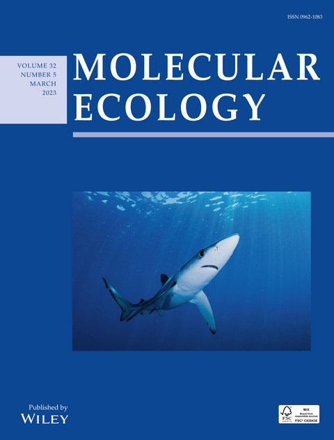
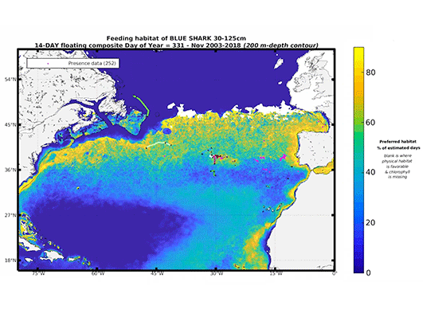

<nav class="navigation">
  <ul>
    <li><a href="#journals">Journal Articles and Book Chapters</a></li><!--
    --><li><a href="#reports">Technical Reports, Theses and Consultancy Works</a></li><!--
    --><li><a href="#policy">Policy and Public Outreach</a></li><!--
    --><li><a href="#software">Software and Data</a></li>
  </ul>
</nav>

Publications
=============

Journal Articles and Book Chapters
----------------------------------

 - Delord, C., Arnaud-Haond, S., **Leone, A.**, Rolland, J., Nikolic, N. (2024). Unraveling the complexity of the Ne/Nc Ratio for conservation of large and widespread pelagic species: current status and challenges. __*Evolutionary Applications*__, 17(10): e70020. doi: https://doi.org/10.1111/eva.70020 [View Publication](https://doi.org/10.1111/eva.70020).
   
 - **Leone, A.**, Arnaud-Haond, S., Babbucci, M., Bargelloni, L., Coscia, I., Damalas, D., Delord, C., Franch, R., Garibaldi, F., Macias, D., Mariani, S., Martinsohn, J., Megalofonou, P., Micarelli, P., Nikolic, N., Prodöhl, P.A., Sperone, E., Stagioni, M., Zanzi, A., Cariani, A., Tinti, F. (2024). Population genomics of the blue shark, Prionace glauca, reveals different populations in the Mediterranean Sea and the North East Atlantic. __*Evolutionary Applications*__, 17(9): e70005. doi: https://doi.org/10.1111/eva.70005 [View Publication](https://doi.org/10.1111/eva.70005)
 
 - Bowlby H.D., Druon JN, Lopez J, Juan-Jordá M.J., Carreón-Zapiain M.T., Vandeperre F., **Leone A.**, Finucci B., Sabarros P.S., Block B.A., Arrizabalaga H., Afonso P., Musyl M.K., Coelho R., Cortés E., Cardoso L.G., Mourato B., Queiroz N., Fontes J., Abascal F.J., Zanzi A., Hazin H.G., Bach P., Sims D.W., Travassos P. (2024). Global habitat predictions to inform spatiotemporal fisheries management: Initial steps within the framework. __*Marine Policy*__, 164:106155. doi: https://doi.org/10.1016/j.marpol.2024.106155 [View Publication](https://doi.org/10.1016/j.marpol.2024.106155)

 - Langeneck, J., Bakiu, R., Chalari, N., Chatzigeorgiou, G., Crocetta, F., Doğdu, S. A., Durmishaj, S., Galil S., B., García-Charton, J. A., Gülşahin, A., Hoffman, R., **Leone, A**., Lezzi, M., Logrieco, A., Mancini, E., Minareci, E., Petović, S., Ricci, P., Orenes-Salazar, V., Salimeh, M., Sperone, E., Spinelli, A., Stern, N., Tagar, A., Tanduo, V., Taşkin, E., Tiralongo, F., Trainito, E., Turan, C., Yapici, S., Zafeiridis, I., & Zenetos, A. (2023). New records of introduced species in the Mediterranean Sea (November 2023). __*Mediterranean Marine Science*__, 24(3), 610–632. doi: https://doi.org/10.12681/mms.35840 [View Publication](https://doi.org/10.12681/mms.35840)
 
 - Nikolic N, Devloo-Delva F, Bailleul D, Noskova E, Rougeux C, Delord C, Borsa P, Liautard-Haag C, Hassan M, Marie A, Feutry P, Grewe P, Davies C, Farley J, Fernando D, Biton-Porsmoguer S, Poisson F, Parker D, **Leone A**, Aulich J, Lansdell M, Marsac F, Arnaud-Haond S. (2023). Stepping up to genome scan allows stock differentiation in the worldwide distributed blue shark *Prionace glauca*. __*Molecular Ecology*__, 3(5): 1000-1019. doi: https://doi.org/10.1111/mec.16822 [View Publication](https://doi.org/10.1111/mec.16822)

**Publication Cover** 

 - Bargnesi F., Moro S., **Leone A**., Giovos I., Ferretti F. (2022). New technologies can support data collection on endangered shark species in the Mediterranean Sea. __*Marine Ecology Progress Series*__, 689:57-76. doi: https://doi.org/10.3354/meps14030 [View Publication](https://doi.org/10.3354/meps14030)

-  Druon JN., Campana S., Vandeperre F., Hazin F.V., Bowlby H., Coelho R., Queiroz N., Serena F., Abascal F., Damalas D., Musyl M.K., Lopez J., Block B.A., Alfonso P., Dewar H., Sabarros P.S., Finucci B., Zanzi A., Bach P., Senina I., Garibaldi F., Sims D.W., Navarro J., Cermeño P., **Leone A**., Diez G., Teresa M., Deflorio M., Romanov E.V., Jung A., Lapinsky M., Francis M., Gomes Hazin H., Travassos P. (2022). Global-scale environmental niche and habitat of blue shark (*Prionace glauca*) by size and sex: a pivotal step to improving stock management. __*Frontiers in Marine Science*__, 9:828412. doi: https://doi.org/10.3389/fmars.2022.828412 [View Publication](https://doi.org/10.3389/fmars.2022.828412)

**EU-JRC Blue Shark Ecological Niche Animations** 

-  **Leone A**., Puncher G.N., Ferretti F., Cariani A., Sperone E., Micarelli P., Gambarelli A., Sarà M., Arculeo M., Doria G., Garibaldi F., Dall’Asta A., Minelli D., Cilli E., Vanni S., Serena F., Diaz-Jaimez P., Tinti F. (2020). Pliocene colonization of the Mediterranean by Great White Shark inferred from fossil records, historical jaws, phylogeographic and divergence time analyses. __*Journal of Biogeography*__, 47(5): 1119-1129. doi: https://doi.org/10.1111/jbi.13794 [View Publication](https://doi.org/10.1111/jbi.13794)

**Media Coverage and Public Outreach** 

-  Leonetti FL, Giglio G, **Leone A**, Coppola F, Romano C, Bottaro M, Reinero FR, Milazzo C, Micarelli P, Tripepi S, Sperone E. 2020. An updated checklist of chondrichthyans of Calabria (Central Mediterranean, southern Italy), with emphasis on rare species. __*Mediterranean Marine Science*__, 21:794–807. doi: https://doi.org/10.12681/mms.23321 [View Publication](https://doi.org/10.12681/mms.23321)

-  **Leone A**., Leone A., Álvarez P., García D., Saborido-Rey F., and Rodriguez-Ezpeleta N. (2019). Genome-wide SNP based population structure in European hake reveals the need for harmonizing biological and management units. __*ICES Journal of Marine Science*__, 76(7): 2260-2266. doi: https://doi.org/10.1093/icesjms/fsz161 [View Publication](https://doi.org/10.1093/icesjms/fsz161)

-  Puncher G.N., Cariani A., Cilli E., Massari F., **Leone A**., Morales-Muñiz A., Onar V., Toker N.Y., Casasola D.B., Moens T., Tinti F. (2019) Comparison and optimization of genetic tools used for the identification of ancient fish remains recovered from archaeological excavations and museum collections in the Mediterranean region. __*International Journal of Osteoarchaeology*__, 29(3):  365– 376. doi: https://doi.org/10.1002/oa.2765 [View Publication](https://doi.org/10.1002/oa.2765)

-  **Leone A**., Urso I., Damalas D., Martinsohn J., Zanzi A., Sperone E., Micarelli P., Garibaldi F., Megalofonou P., Bargelloni L., Franch R., Macias D., Prodöhl P., Fitzpatrick S., Stagioni M., Tinti F., Cariani A. (2017). Genetic differentiation and phylogeography of Mediterranean-North Eastern Atlantic blue shark (*Prionace glauca*, L. 1758) using mitochondrial DNA: panmixia or complex stock structure? __*PeerJ*__, 5:e4112. doi: https://doi.org/10.7717/peerj.4112 [View Publication](https://doi.org/10.7717/peerj.4112)

-  Micarelli P., Sperone E., Circosta V., **Leone A**., Giglio G, Tripepi S. 2015. Preliminary Observations On Great White Shark (*Carcharodon carcharias*) surface predatory activity. __*Biologia Marina Mediterranea*__, 22 (1), 184-185. [View Publication](https://usiena-air.unisi.it/handle/11365/1227455)

-  Sperone E., Parise G., **Leone A**., Milazzo C., Circosta V., Santoro G., Paolillo G., Micarelli P., Tripepi S. (2012) Spatiotemporal patterns of distribution of large predatory sharks in Calabria (central Mediterranean, southern Italy). __*Acta Adriatica*__, 53: 13-24. [View Publication](https://acta.izor.hr/ojs/index.php/acta/article/view/331)

 
**Technical reports/articles**   

 -  Davies, Campbell; Marsac, Francis; Murua, Hilario; Fraile, Igaratza; Fahmi, Zulkarnaen; Farley, Jessica; Grewe, Peter; Proctor, Craig; Clear, Naomi; Lansdell, Matt; Aulich, Jorden; Feutry, Pierre; Cooper, Scott; Foster, Scott; Rodriguez-Ezpeleta, Naiara; Artetxe-Arrate, Iraide; Nikolic, Natacha; Krug, Iñigo; Mendibil, Iñaki; **Leone, Agostino**; Labonne, Maylis; Darnaude, Audrey; Arnaud-Haond, Sophie; Wudianto; Ruchimat, Toni; Satria, Fayakun; Lestari, Pratiwi; Taufik, Muhammad; Priatna, Asep; Zamroni, Achmad. Study of population structure of IOTC species and sharks of interest in the Indian Ocean using genetics and microchemistry: an update on progress and preliminary results. Online: __*IOTC*__; 2019. http://hdl.handle.net/102.100.100/442173?index=1. [View Publication](http://hdl.handle.net/102.100.100/442173?index=1)

 - Babcock E.A., Beare D., Carvalho F., Cortés E., Courtney D., Doody C., Green P., Hazin F.H.V., Hazin H., **Leone A**., Liu K.-M., Mourato B., O’Reilly S., Roche W., Tsai W.-P, Winker H., Wögerbauer C.  (2016) Report of the 2015 ICCAT Blue Shark stock assessment session. SCRS/2015/018, __*Collective Volume of Scientific Papers ICCAT*__, 72(4): 866-1019. Available at:          https://www.iccat.int/Documents/CVSP/CV072_2016/n_4/CV072040866.pdf [View Publication](https://www.iccat.int/Documents/CVSP/CV072_2016/n_4/CV072040866.pdf)
