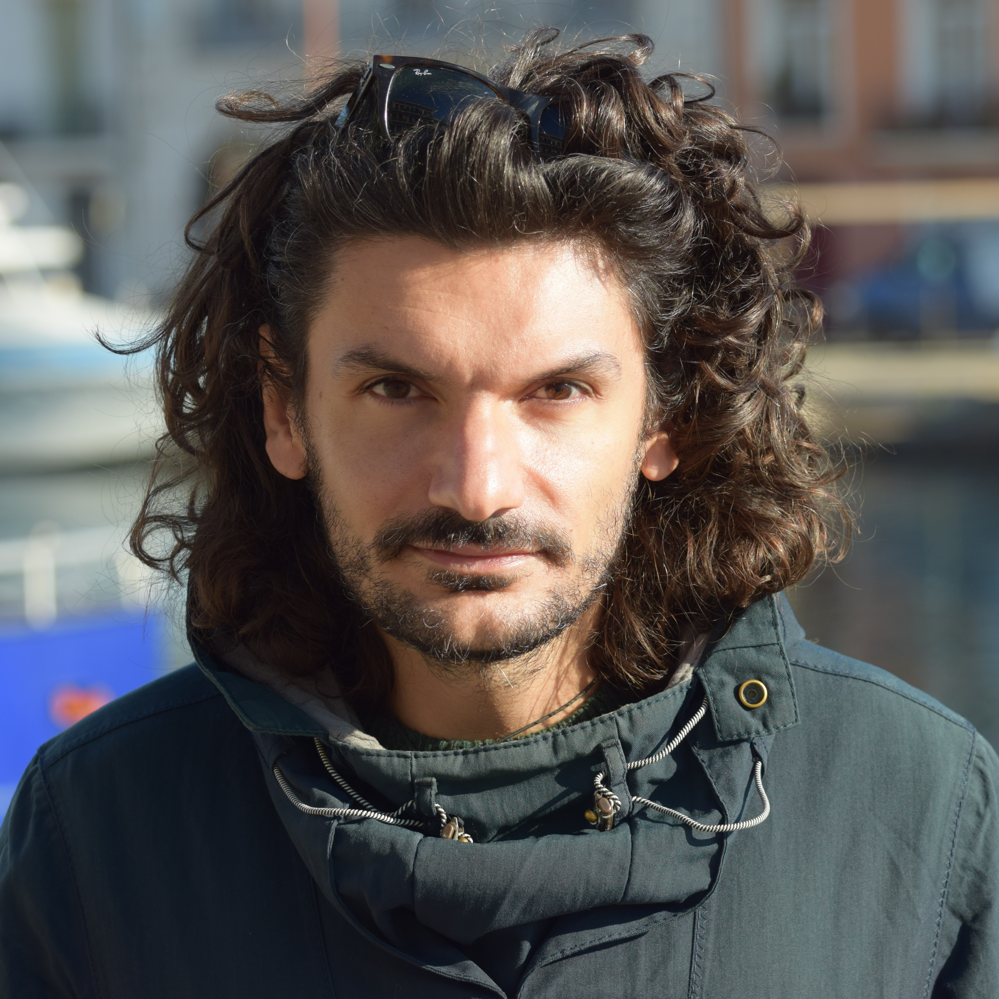

## Agostino Leone CV

# AGOSTINO LEONE, Ph.D.
Via Archirafi, 20, 90123, Palermo, Italy

personal email: agostino.leone2@gmail.com

current professional email: agostino.leone@unipa.it

Orcid:  [[0000-0002-3927-7563](https://orcid.org/0000-0002-3927-7563)].

Scopus Author ID: [[55454170900](https://www.scopus.com/authid/detail.uri?authorId=55454170900)].

_________________________________________________________________________________
---
layout: default
title: CV
---

<nav class="navigation">
  <ul>
    <li><a href="#positions">Positions</a></li><!--
    --><li><a href="#past">Past Positions</a></li><!--
    --><li><a href="#education">Education and Qualifications</a></li><!--
    --><li><a href="#editorial">Software and Data</a></li>
  </ul>
</nav>

Positions
=============

Current Position
----------------------------------
Researcher in Marine Molecular Ecology and Population Genetics University of Palermo
02/03/2023 – present
Marine Ecology & Conservation Lab (MecLab)
Department of Earth and Marine Science (DiSTeM)
University of Palermo
Via Archirafi, 20 - 90123 - Palermo (PA), Italy

Past Positions
----------------------------------
- 15/07/2022 – 27/02/2023 Research Fellow in Marine Molecular Ecology University of Bologna Laboratory of Genetics and Genomics of Marine and Environmental Resources Alma Mater Studiorum - University of Bologna Dept. Biological, Geological & Environmental Sciences, Via Sant'Alberto, 163 - 48100 Ravenna, Italy

- 04/01/2021 – 03/07/2022 Postdoctoral Researcher in Marine Molecular Ecology IFREMER, MARBEC, Institut Français de Recherche pour l'Exploitation de la MER (IFREMER) Marine Biodiversity Explotation and Conservation (MARBEC), Station de Sète - Avenue Jean Monnet - 171 - 34203, Sète Cedex, France

- 29/06/2018 – 28/06/2019 Researcher in Marine Molecular Ecology AZTI, Marine Research Division, Txatxarramendi ugartea z/g, 48395 Txatxarramendi, BI, Spain

Education and Qualifications
----------------------------------

- PhD in Earth, Life and Environmental Science University of Bologna 2014 - 2018, Thesis: Genomic applications in fish traceability and fishery stock management: phylogeography and population structure of the Mediterranean-Atlantic blue shark, _Prionace glauca_

- M.Sc. in Marine Biology University of Bologna 2011 - 2013

- B.Sc. in Evolutionary & Comparative Biology University of Calabria
 

 

Editorial Membership and Peer Review Activity
----------------------------------

#Editorial Member (Review Editor) of [[Endangered Species Research](https://www.int-res.com/journals/esr)].

Reviewer for:
- Heredity
- Ecology and Evolution
- Fisheries Research
- Reviews in Fish Biology and Fisheries
- Journal of Fish Biology
- Marine Pollution Bulletin
- PeerJ
- The European Zoological Journal
- Frontiers in Marine Science
- Conservation Genetics Resources
  MDPI... stay back from me

 
