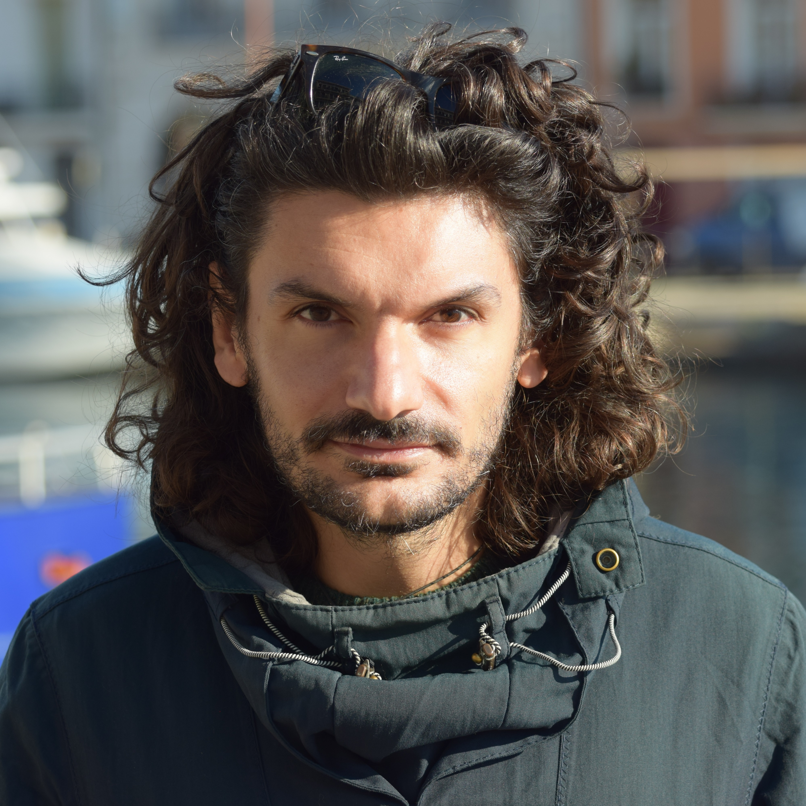

## Public Outreach

_________________________________________________________________________________

<nav class="navigation">
  <ul>
    <li><a href="#Seminars">Seminars</a></li><!--
    --><li><a href="#Podcast">Podcast</a></li>
  </ul>
</nav>

Seminars
=============

- Speaker su invito per l’incontro “Tra Scienza e Parole: la biodiversità fra le righe”, insieme allo scrittore Andrea Tarabbia (Premio Campiello 2019) e moderati da Enrico Bergianti, giornalista e podcaster, collaboratore di Radio24 e docente al Master in Comunicazione della Scienza della Sissa di Trieste. Attività organizzata nell’ambito dello SHARPER-Notter Europea dei Ricercatori e promossa da NBFC. https://www.sharper-night.it/evento/tra-scienza-e-parole-la-biodiversita-fra-le-righe/

Podcast
=============

- Ospite come speaker per il podcast “Biodiversità tra le righe” Episodio 1 “Calamari giganti e Ba-lene Albine”. Link alla puntata su piattaforma Spotify:
https://open.spotify.com/episode/6GTmhoWznfijjLYzch7QOB?si=10798d2303174a9b
- Ospite come speaker per il podcast “Individui. La personalità animale” Episodio 4 “La Fortuna aiuta gli audaci?” . Link alla puntata su piattaforma Spotify:
https://open.spotify.com/episode/71gkxDn4d7coa9i9XEOkJq?si=MsCYuHg8QfaRzBgBFcCkZA